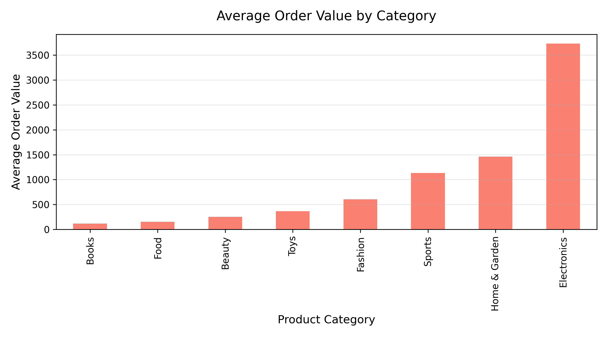
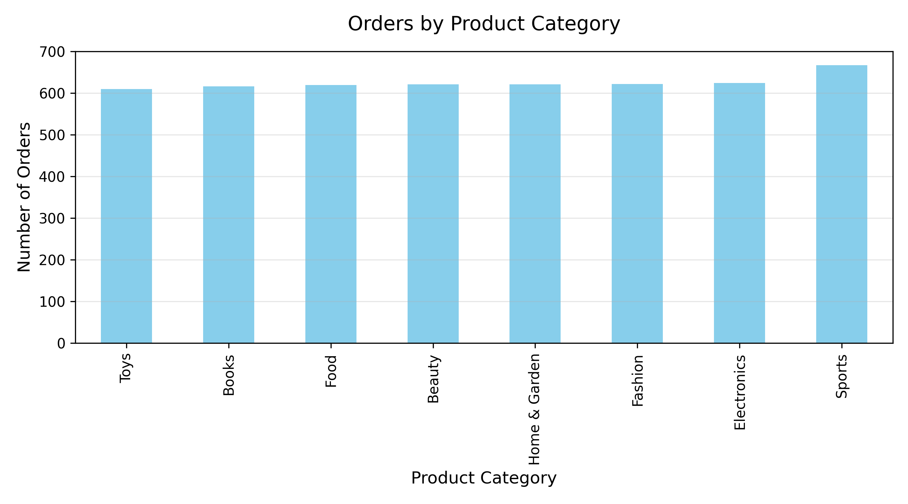
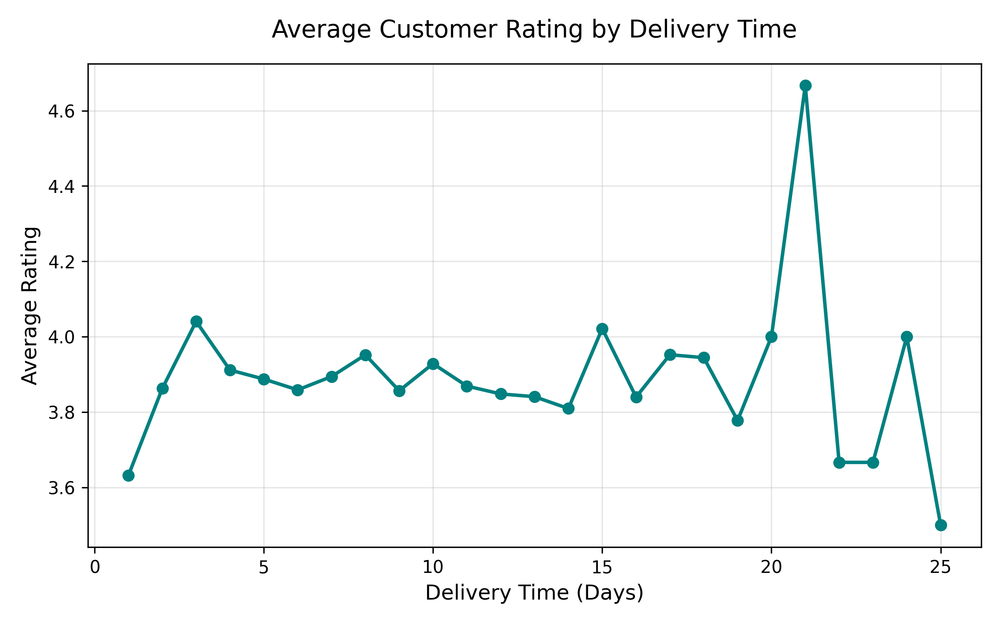

# E-Commerce Customer Behavior Analysis
## Business Objective
Determine which order characteristics are associated with a customer being a returning buyer.
## Dataset
 * 5,000 orders
 * 5,000 users
 * No missing values
 * Includes the target feature Is_Returning_Customer
## Limitations
Since each user corresponds to only a single order, it is impossible to independently calculate metrics such as retention rate, LTV, or cohort metrics. The analysis relies on the pre-existing Is_Returning_Customer feature. Additionally, the dataset is synthetic.
## Research Plan
 1. Data Overview
 2. Exploratory Data Analysis (EDA)
 3. Hypothesis Testing (4 hypotheses)
 4. Key Findings & Conclusion
## Preliminary Findings
### Product Categories
The proportion of returning customers varies only slightly (ranging roughly from 58% to 62%). Therefore, the product category does not appear to be a strong factor associated with customer retention.
### Average Order Value (AOV)
The average order value for new versus returning customers is practically identical.
### Customer Ratings
The average ratings given by new and returning customers are nearly identical (3.90 and 3.91, respectively). Descriptive statistics show no prominent link between customer return status and the rating provided. A definitive conclusion is established through statistical testing.
### Delivery Times
Based on average ratings, there is no obvious dependency between delivery time and customer satisfaction. Statistical correlation testing is applied for verification.
## Visualizations
### 1. Orders by Product Category

The number of orders across product categories is distributed fairly evenly. The highest number of orders falls into the **Sports** category, though differences between categories remain small.
### 2. Average Order Value by Category

The highest average order value is observed in the **Electronics** category (around 3,000 currency units), followed by **Home & Garden** and **Sports**. The lowest average check belongs to **Books**, **Food**, and **Beauty**.
> This indicates that products across different categories vary significantly in price. While Electronics is the most lucrative category per single order, evaluating its overall effectiveness requires considering additional metrics such as repeat purchase frequency.
### 3. Average Customer Rating by Delivery Time

The chart illustrates the average customer rating depending on the delivery time in days. This visualization helps to track whether longer delivery times negatively impact customer satisfaction.
## Hypothesis Testing
### Hypothesis 1
 * **H₀:** The average order value of new and returning customers does not differ.
 * **Test:** Mann–Whitney U test
 * **Results:**
   *    *  * **Conclusion:** At a significance level of \alpha = 0.05, there is no statistical ground to reject the null hypothesis. No statistically significant difference in order amounts was found between new and returning customers.
### Hypothesis 2
 * **H₀:** Ratings given by new and returning customers do not differ.
 * **Test:** Mann–Whitney U test
 * **Results:**
   *    *  * **Conclusion:** No statistically significant differences were found in customer ratings between new and returning users.
### Hypothesis 3
 * **H₀:** Product category is not associated with customer return status.
 * **Test:** Pearson's Chi-Square test (\chi^2)
 * **Results:**
   *    *  * **Conclusion:** There is no evidence to claim that product category is associated with the likelihood of a customer returning.
### Hypothesis 4
 * **H₀:** There is no relationship between delivery time and customer rating.
 * **Test:** Spearman's rank correlation (\rho)
 * **Results:**
   *    *  * **Conclusion:** No statistically significant correlation was found between delivery time and customer ratings.
## Overall Conclusion
The study analyzed online store order characteristics and tested four statistical hypotheses. None of the hypotheses received statistical confirmation at the significance level of \alpha = 0.05. This implies that the examined dataset reveals no significant differences between new and returning customers regarding order amount and ratings, nor does it establish dependencies between product categories, delivery times, and customer return status.
It is important to consider that the analysis performed on a synthetic dataset containing only one order per customer. This inherently limits retention analysis and explains the absence of pronounced behavioral patterns.
## How to Run the Project
 1. Clone the repository:
   ```bash
   git clone <repository-url>
   
   ```
 2. Install the required dependencies:
   ```bash
   pip install pandas matplotlib scipy
   
   ```
 3. Run the analysis script:
   ```bash
   python analysis.py
